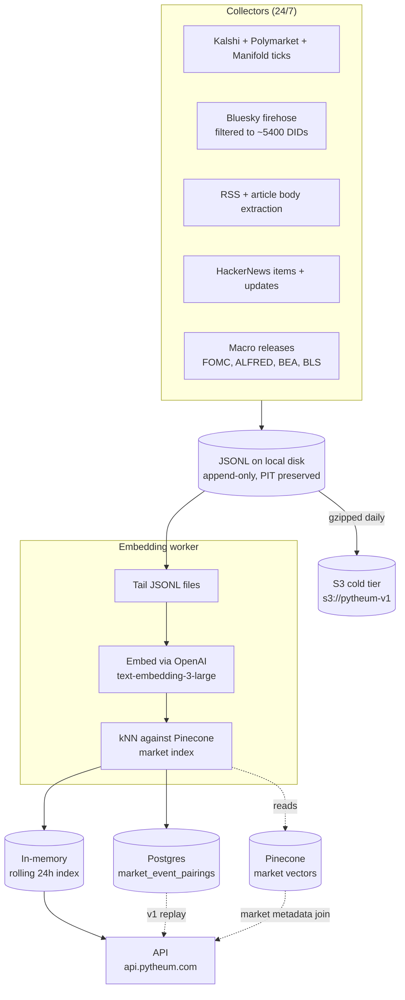

# Architecture

A 30-second tour of what's behind the four endpoints.

## Index composition

- **Markets** (Pinecone): top ~10k by volume across Kalshi + Polymarket + Manifold. Embedded once at backfill time; refreshed periodically. See [Embedding & Pairing](embedding-pairing.md).
- **Events** (rolling 24h, in-memory): every news/social/HN/macro event from the last 24h that passed the [watchlist filter](watchlist.md). Capped at 8,000 entries FIFO.
- **Pairings** (Postgres, durable): every (event, market, similarity) tuple is logged for [PIT replay](pit.md) in v1.

## Storage tiers

| Tier | Where | What |
|---|---|---|
| Hot | EC2 local disk | JSONL being written, in-memory rolling index, Pinecone serverless |
| Warm | Postgres (Supabase Pro) | Markets metadata + pairings log |
| Cold | S3 (`s3://pytheum-v1`) | JSONL.gz daily partitions |

The Pinecone index is canonical for **vectors**. Postgres is canonical for **metadata**. The API JOINs them at query time.

## See also

- [Point-in-time](pit.md) — what we guarantee about historical accuracy
- [Embedding & Pairing](embedding-pairing.md) — how events get matched to markets
- [Watchlist](watchlist.md) — why we filter the Bluesky firehose
